<h1>
Collaborative Humanities
</h1>

[DH nord]() - 15/10/2018
  
 

Paul Girard [@paulanomalie](https://twitter.com/paulanomalie) 
médialab, Sciences Po [@medialab_scpo](https://twitter.com/medialab_scpo)

---

## I. Collaboration ?
## II. Digital, Humanities and Design
## III. Side effects

---

# I. Collaboration ?

*As seen from an old but determinant personnal work.*

---

<!-- .element: style="width:80%"-->

---
## To solve a complex problem

Complex ?

- neither a sum of simple problems (only needs more persons)
- neither a sum of complicated ones (solvable by experts) 
- a challenge which needs the collaboration of several people and not the sum of their expertise.

Note:
  On entend par complexe, un problème qui n’est ni la somme de problèmes simples (pouvant être résolu par une personne) ni la somme de problèmes compliqués (pouvant être résolu par un ensemble de personnes expertes) mais bien un problème qui nécessite la mise en coopération de plusieurs personnes et non la somme d’expertises

---
## A systemic and empiric approach
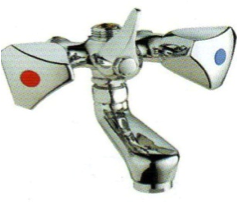<!-- .element style="float:left; margin: 8px 15px 15px 15px ;"--> The shower mixer as a complex situation when hot and cold water taps are controlled by two different persons.  
How to control both temperature and flow without collaborating ?  
Systems analysis refer to such situations as a coupling issue.  
 
LE CARDINAL G., GUYONNET J.F., POUZOULLIC B., La dynamique de la confiance : Construire la confiance dans les projets complexes. Dunot : Paris, 1997.

Note:
"L’expérience menée dans la dynamique de la confiance1 propose un type de projet complexe apte à l’expérimentation. La problématique est de réussir à atteindre deux objectifs distincts (régler la température et le débit d’eau d’une douche) à l’aide de plusieurs entrées (les robinets) qui interagissent sur les deux sorties. Il faut donc en terme scientifique découpler un système qui comporte des entrées couplées. Un problème compliqué que sait résoudre l’automatique qui deviendra complexe quand deux expérimentateurs devront trouver ensemble une solution."

MEUNIER J.P., Deux modèles de la communication des savoirs. GreMS : http://www.comu.ucl.ac.be/reco/grems/jpweb/models.htm, Juin 2002.
---
## Coupling issue in systems

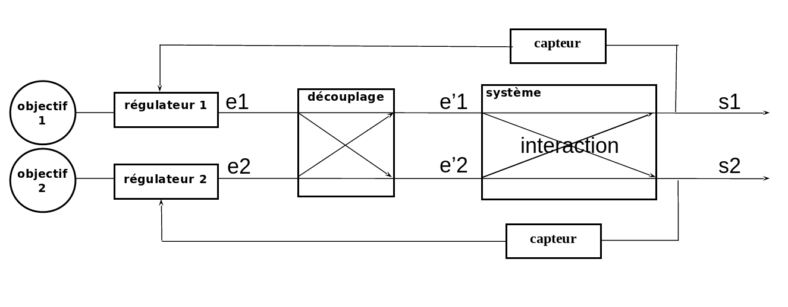

<quotes>"To solve a complex issue, one  has to add complexity."(Girard et Vanesse 2002)</quotes>

---
## Communication for decoupling
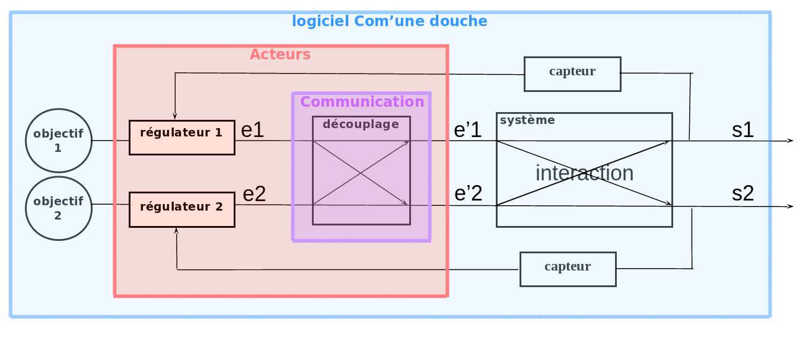

(Girard et Vanesse 2002)

---
## Com'une douche
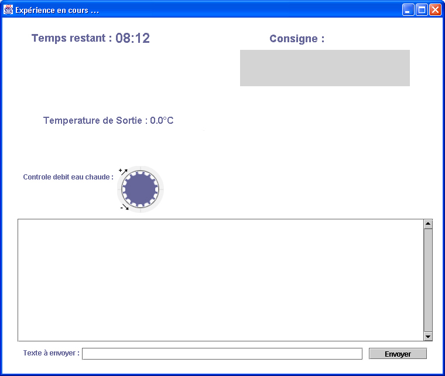<!-- .element: style="width:48%;margin:0px;display:inline;" --> 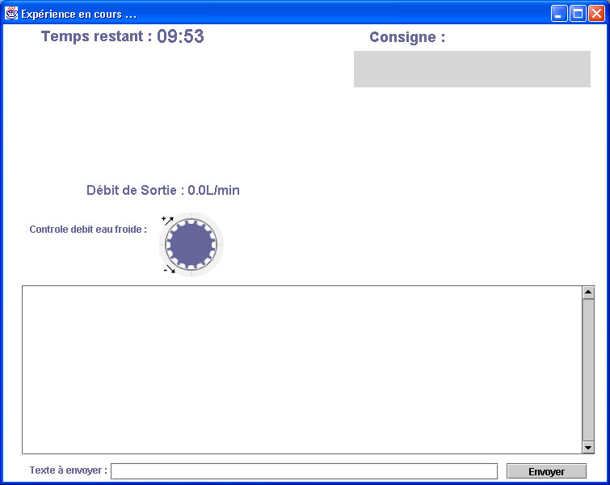<!-- .element: style="width:48%;margin:0px;display:inline;" -->
---

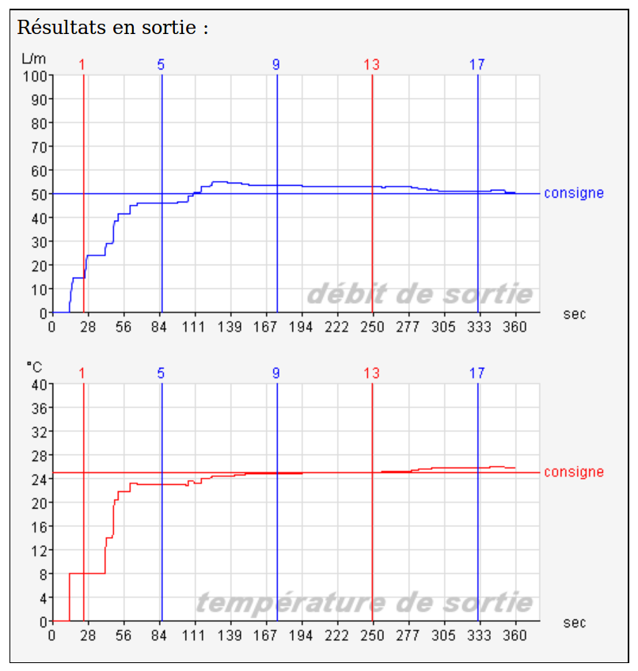<!-- .element: style="width:60%;margin:0px;display:inline;" -->
---

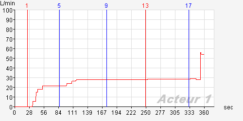

---
-1 Acteur 1 : l'un de nous controle le debit et l'autre la temp    **contexte**  
-2 Acteur 2 : tu as un robinet eau chaude?    
-3 Acteur 1 : oui    
-4 Acteur 1 : et toi robinet debit
-5 Acteur 2 : OK moi c'est eau froide et je ne controle que le debit    **qualification**  
-6 Acteur 2 : tu dois arriver a quelle temperature?    
-7 Acteur 1 : a 25 JE SUIS A 24.4    
-8 Acteur 1 : 24.77    
-9 Acteur 2 : OK la temperature influe sur le debit et vice versa ou non?    **interaction**
-10 Acteur 1 : OUI 24.9    
-11 Acteur 1 : 24.95    
-12 Acteur 2 : Bon je dois atteindre un debit de 50 je suis a 52,7   
---

-13 Acteur 1 : OK j'augmente la temp **action**
-14 Acteur 1 : 25.11    
-15 Acteur 1 : 25.44    
-16 Acteur 1 : tu vas dans le mauvais sens pour moi 25.8    
-17 Acteur 2 : Bon je suis a 50,75 **info**  
-18 Acteur 2 : Je ne bouge plus    
-19 Acteur 2 : tu es a combien    

---

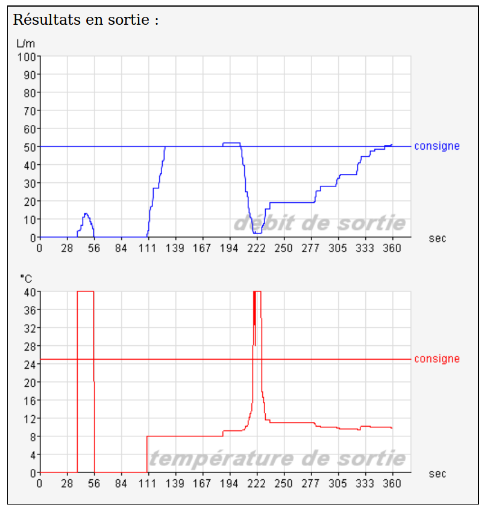<!-- .element: style="width:60%;margin:0px;display:inline;" -->
---

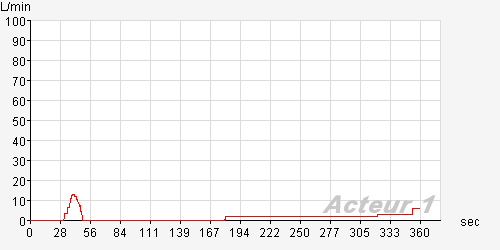
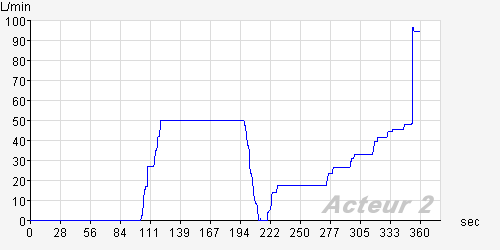
---
-1 Acteur 2: vas y explique    
-2 Acteur 1: bon cette fois ci on essaie que ce soit moi qui reussisse!    
-3 Acteur 2: vas y    
-4 Acteur 1: je teste en tournqnt mon robinet, ne fqis rien    
-5 Acteur 2: ok    
-6 Acteur 1: mon robinet ne passe que pqr 0 ou 40    
-7 Acteur 2: c'est chelou    
-8 Acteur 1: il est binanire    
-9 Acteur 1: faut que ce soit toi qui fqsse tournr le tien    
-10 Acteur 2: ferme le tien j'ouvre le mien    
-11 Acteur 1: vqs y, et je te dis stop quand j'qrrive a la temp    
-12 Acteur 2: je suis a 50    
-13 Acteur 2: je ne peux pas aller plus loin    
-14 Acteur 1: Attend, tout al heure tu etaits stabilisé a 25 et moi 35, donc essqie de te stqbiliser a 15    
-15 Acteur 2: eh oh, t'es la    
-16 Acteur 2: ok    
---
-17 Acteur 1: putain, maintenant il est a 8   
-18 Acteur 1: Ah, ca monte    
-19 Acteur 2: ne bouge pas    
-20 Acteur 1: encore    
-21 Acteur 1: encore    
-22 Acteur 1: je ne bouge pas t'inquietes!    
-23 Acteur 1: descend    
-24 Acteur 1: stoip    
-25 Acteur 1: monte    
-26 Acteur 1: un tout petit peu    
-27 Acteur 1: encore    
-28 Acteur 2: je suis à 18,85    
-29 Acteur 1: et moi a 21    
-30 Acteur 1: 0,8    
-31 Acteur 1: merde, a 10,8    
-32 Acteur 2: bouge pas    
-33 Acteur 1: monte encore    
---
-34 Acteur 1: je gqlère avec le clavier    
-35 Acteur 1: monte encore bcp plus    
-36 Acteur 2: j'vais me mettre une balle    
-37 Acteur 1: aller putqin, tu vas monter    
-38 Acteur 1: encore    
-39 Acteur 1: mets toi au maxi    
-40 Acteur 2: il y a un retard  
---
## To communicate

- Objectives: variations are not perturbation but personnal objectives
- Information: create a common vision by sharing information
- Actions: inform about past, present and future actions to allow coordination

---
## Conflict resolution

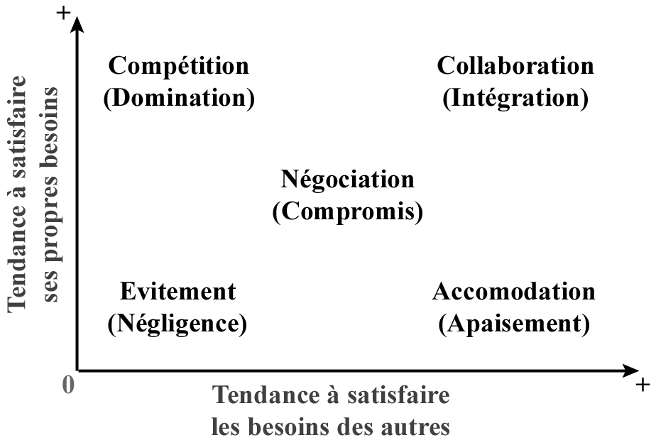<!-- .element: style="width:60%;margin:0px;"-->

EISEMAN J.W., The Journal of Applied Behavioral Science: « The third party consultation model for resolving recuring conflict collaboratively ». 1977. 13, 3, p. 104
---
## Creativity

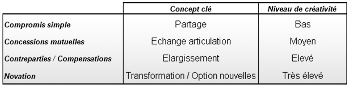<!-- .element: style="width:60%;margin:0px;"-->

DUPONT C., La négociation. Dalloz : Paris, 1986. p. 22.
---
## Decoupling scenarios

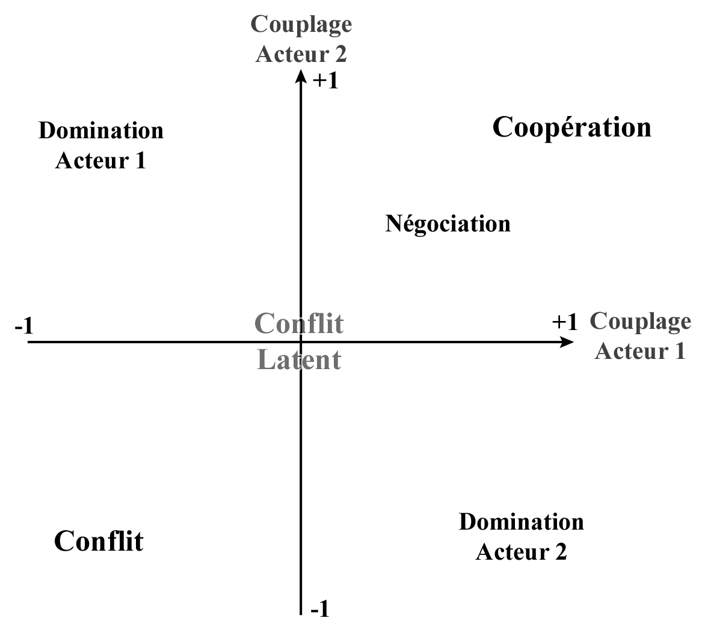<!-- .element: style="width:60%;margin:0px;"-->

---
# II. Digital, Humanities and Design

*As seen from the médialab experience.*

---
[<!-- .element: style="height: 150px;"-->](http://medialab.sciencespo.fr)

Founded in 2009 by Bruno Latour, directed by Dominique Cardon since 2017.

*Sociology of digital public spaces, Science and Technology Studies, french Parliament studies, Art & ideas history, Economic history, Natural Language Processing, web as a research fields, visual exploratory data analysis instruments, pedagogical innovations...*  

**Ambition to invent new research instruments**
---
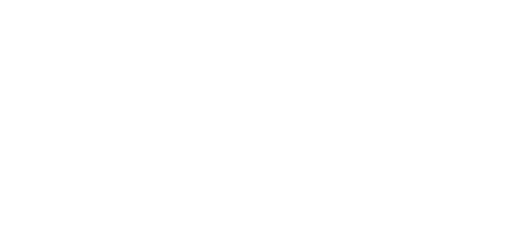

* Three pilars *

---
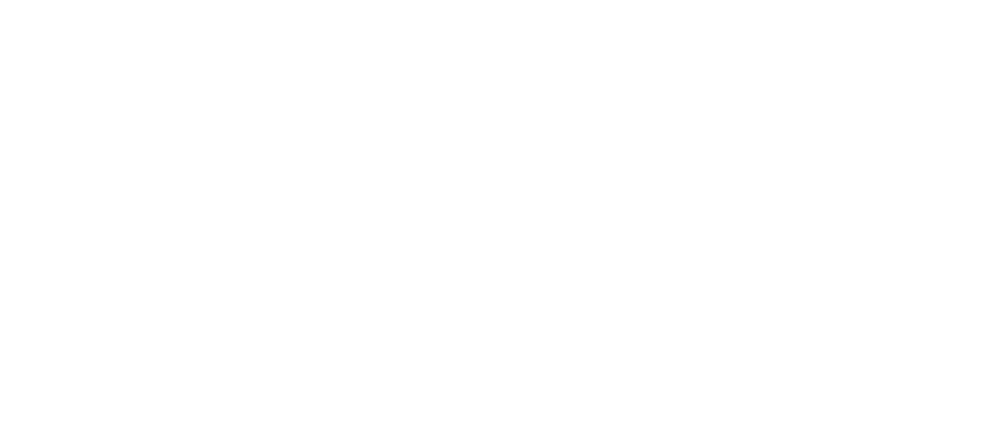

* Three bridges *

---
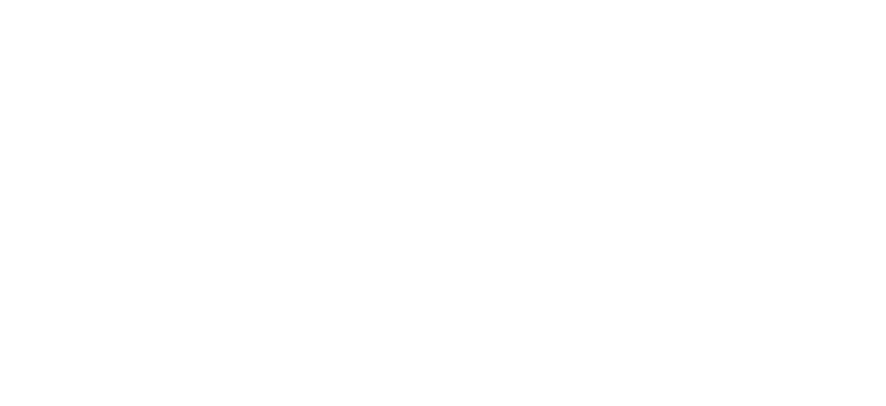

* Different kinds of publications *

---
## Data sprints

To build visual exploration of complex datasets we organize **interdisciplinary** design workshops :

- Social Sciences and/or Humanities
- Engeniery & Data Science
- Information and Interactive Design

 
Adressing **content**, **implementation** and **design** issues  
at the same place and at the same time.
---
# III. Side effects

*The daily life of collaboration issues.*

---

## Daily life

To care the necessary frictions between different cultures:  

- shared governance (more on this later)
- weekly team lunch
- internal research seminar  
- [METAT](http://www.sciencespo.fr/recherche/fr/content/metat-latelier-de-methodes), monthly research methods workshop

---
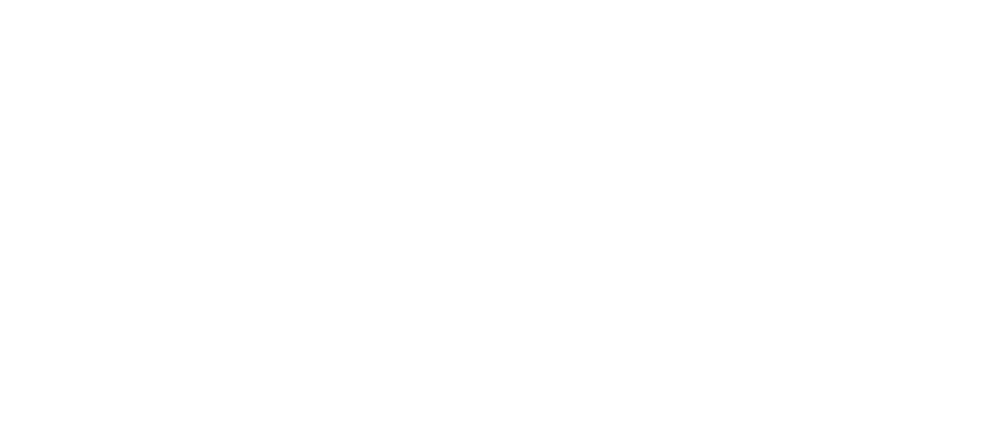

* continuous inter-disciplinary space *

---
## The hybridation contradiction

Trying to act as the other side of the collaboration is dangerous (engineers wanted to be social scientists or designers).  
It implies frustrations and breaks the principles that we need complementary skills.  
---
## The hybridation contradiction

But hybrid profiles fuel the collaboration process.  
Not only we need but a daily integration produces such hybridations.
---
## aRt&D by V2_ Rotterdam (2005)
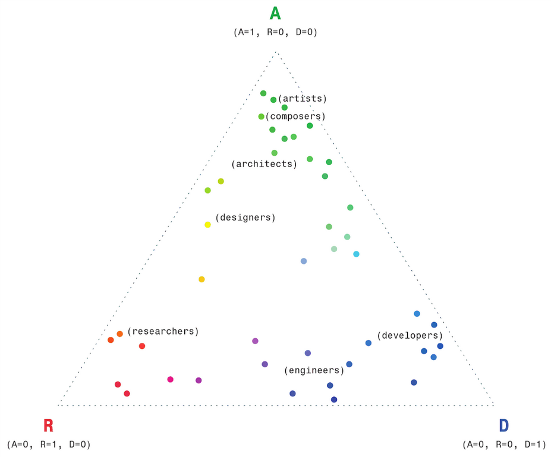<!-- .element: style="width: 70%;margin:0 10px;float:left;"-->  
A for Art  
R for Research  
D for Development 

---
 
Long-term background refined by modifiers: α (humanities), β (natural science and technology) and γ (social sciences).

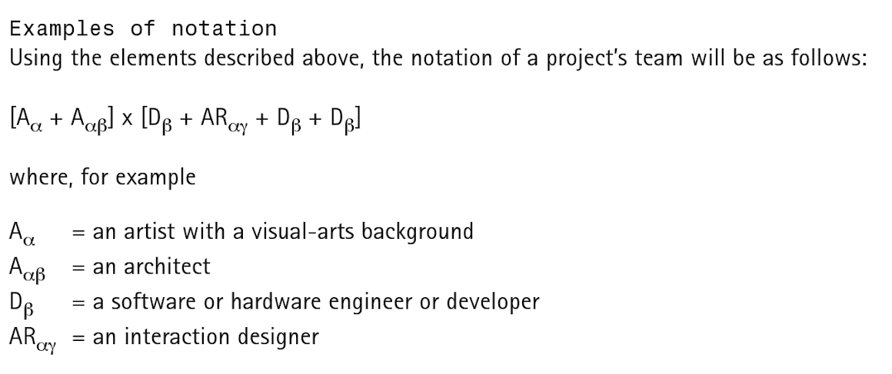

Publishers, NAi, et Joke Brouwer. ARt & D: Research and Development in Art. V2_ publishing, 2005.

---

## What status for the methodological research ? 

- What does research means in *research engineers* ?
- What doew research means for designers ?

A common ground with design and art school starting research programs : 
**Recherche Action**

Note: 
difference between reseach engineer and computer scientists

---

## Supporting research ?

In french academic world, engineers and designers working in a Social Sciences context are called *"Appui et support à la recherche"*.  
Putting them underneath researchers.   
Without needing to be researchers, they need a more comparable position to ensure productive collaborations.
  
Médialab's status doesn't apply quota on academic status to be elected in the unit research council.

---
## Get used to instability 

A hack of academic world to foster innovations.  
An unstable set-up.

---

Thank you

[http://medialab.sciences-po.fr](http://medialab.sciences-po.fr)  
[http://medialab.github.io/publications/datarama3](http://medialab.github.io/publications/datarama3)

