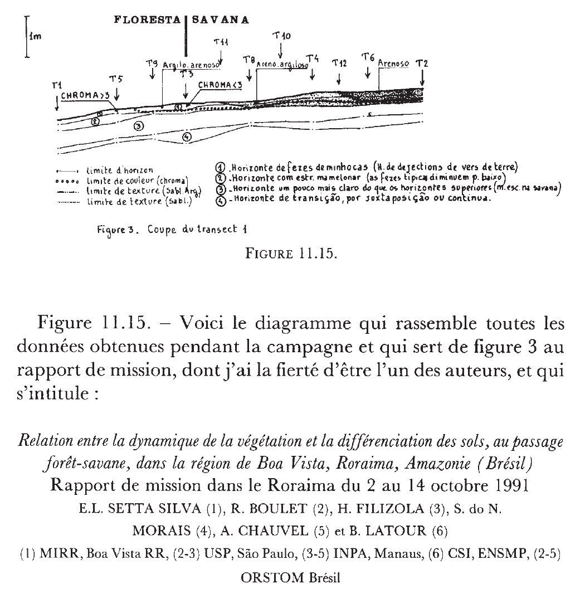
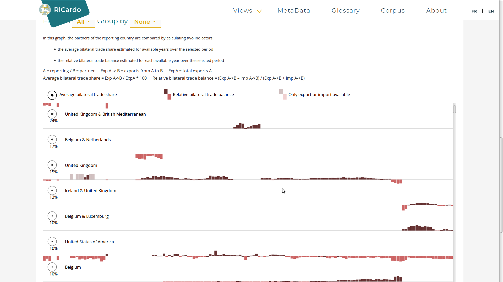

<h2>
Raconter des histoires avec des données en Sciences Humaines et Sociales
</h2>

[Datarama #3 - data storytelling](https://www.eventbrite.fr/e/billets-datarama-3-data-storytelling-46971432820) le 19/09/2018
  
  

Paul Girard [@paulanomalie](https://twitter.com/paulanomalie) 
médialab, Sciences Po [@medialab_scpo](https://twitter.com/medialab_scpo)

Note:
annonce du plan ?

- présentation du contexte
- ~écrire~ répondre à des questions avec des données : 
 - amplification par réduction
 - amplification par simplification 
 - démystification de l'immédiate évidence du numérique 
 - déceler un tout par l'exploration 

- collecter : Hyphe et hybro => construction quanti-qualitative, 
  - la notion de site web n'existe pas
  - le choix humain au coeur de la construction des données
  - importance de l'interface homme-machine
Citer la conf web studies

- l'exploration visuelle comme méthode de recherche 
  - datascape: RICardo
  - structurer - modéliser
  - explorer - analyse visuelle

- le versionning des données
 
- confirmer : explorer n'est pas confirmer
- générique versus spécifique
- écriture : publier un outil d'exploration n'est pas écrire
    - medea
    - manylines

- raconter l'histoire de nos données 

qu'est ce qu'on écrit ?

- des articles ou communication
- des expériences pédagogiques

    exemple de story telling réseaux web sans outils http://controverses.sciences-po.fr/cours/salle_shoot_10/
- des logiciels
- des données

---

[<!-- .element: style="height: 150px;"-->](http://medialab.sciencespo.fr)

- Sociologie numérique
- Sociologie des Sciences et des Techniques
- Recherche méthodologique
- Innovation Pédagogique 

---

## Un collectif fondé sur trois disciplines

- Sciences Humaines et Sociales
- Ingénierie
- Design

Note:
Trois premières embauches dont un étudiant de l'école de design de nantes
---

## Pourquoi et comment raconter des histoires avec des données en Sciences Humaines et Sociale ?

- contexte des SHS et contraintes méthodologiques
- exposer de réalisations tentant de résoudre ces points
- l'importance du design

---
## recherche empirique
Observer, décrire et analyser le monde.  
Des histoires qui tentent de répondre à des questions.

---
## monde > observations > analyses > interprétations > article scientifique
<small>**Latour, Bruno**. *« Le topofil de Boa-Vista. La référence scientifique: montage photophilosophique »*. Raisons pratiques, vol. 4, 1993, p. 187–216.</small>

---

<!-- .element: style="width:70%;margin:0;"-->

Note: Anthropologie d'une enquête scientifique cherchant à comprendre la transition Foret - Savane au Brésil

---

---

---

---
<!-- .element: style="width:80%;margin:0; padding-left:10%"--> 
*(Latour 1993)*

Note: Tout au long du processus d'enquête, le monde (matière) est transformé petit à petit par réductions successives en formes, cad en language. Cette transformation constitue le phénomène qui tranforme le monde en langage. La vérité est transportée le long de cette chaîne. Elle tient si il est possible de repartir en arrière en suivant les références successives.
## une chaîne de transformations traçable et réversible
La démarche scientifique empirique se base sur la **transformation** du monde en langage.  
La référence scientifique tient si la chaîne de transformation est **traçable et réversible**.  
Ces transformations **réduisent** les particularités de la réalité afin d'en **amplifier** un aspect précis à l'aide du langage.

--- 

<!-- .element: style="width:80%;margin:0; padding-left:10%"-->

<small>**McCloud, Scott**. *Understanding Comics: The Invisible Art*. Reprint edition, William Morrow Paperbacks, 1994.</small>

Note:
## mise en forme
Le langage de "cartoon" joue du même principe de réduction/amplification.
L'abstraction (par opposition au réalisme) réduit pour amplifier.  

---

## I. une chaîne de transformations
Toute écriture scientifique y compris la sémiologie est le bout d'une chaîne de transformations.  
Elle opère une nécessaire réduction (symbolisation, abstraction...) du monde.  
Il doit être possible de remonter cette chaîne qui maintient la référence scientifique.

Note: 
L'écriture scientifique n'utilise pas des données pour répondre à une question, elle raconte comment la réponse peut être obtenue en faisant symbolisant le monde par réductions successives.  

---
## <q cite="http://www.digitalhumanities.org/dhq/vol/5/1/000091/000091.html">data as capta</q>

Les données sont toutes le résultat d'une opération d'inscription.    
Les données nativement numériques autant que les échantillons de terre de Boa Vista.  
Leur formalisme leur confère une autorité qui masque les innombrables nuances qu'elles réduisent (et amplifient...).

<small>**Drucker, Johanna**. *« Humanities Approaches to Graphical Display »*. Digital Humanities Quarterly, vol. 5, nᵒ 1, 2011, http://www.digitalhumanities.org/dhq/vol/5/1/000091/000091.html.</small>
---

---

---
## des visualisations expressives ?
<blockquote cite="http://www.digitalhumanities.org/dhq/vol/5/1/000091/000091.html">
                        &ldquo;what is needed is not a set of applications to display humanities “data” but  
                        a new approach that uses humanities principles to constitute capta and its display  
                        [...]  
                        find graphical means of expressing interpretative complexity.&rdquo;  
                        (Drucker 2011)
</blockquote>
<small></small>

Note: I am suggesting that we rethink the foundation of the way data are conceived as capta by shifting its terms from certainty to ambiguity and
---
## II. ~~data~~ capta vizualisation

Donner à voir les contextes de production des données  
Représenter complexité et diversité des réalités et des interprétations  

---
## individus vs. structures

<blockquote cite="http://onlinelibrary.wiley.com/doi/10.1111/j.1468-4446.2012.01428.x/abstract">
 it might be more rewarding to begin navigating datasets without making the distinction between the level of individual component and that of aggregated structure.</blockquote>
<small>**Latour, Bruno, et al.** *« ‘The Whole Is Always Smaller than Its Parts’ - a Digital Test of Gabriel Tardes’ Monads »*. The British Journal of Sociology, vol. 63, nᵒ 4, décembre 2012, p. 590‑615. CrossRef, doi:10.1111/j.1468-4446.2012.01428.x.</small>

---
## déceler des structures par l'exploration
<blockquote cite="http://onlinelibrary.wiley.com/doi/10.1111/j.1468-4446.2012.01428.x/abstract">When we navigate on a screen, zooming in and out, changing the projection rules, aggregating and disaggregating according to different variables, what stands out is what remains constant through the shifting of viewpoints (Gibson 1986). This is our ‘whole’ [...] much smaller than the sum of its parts"
(Latour et al. 2012)
</blockquote> 

---
## capturer la richesse des associations

<blockquote cite="http://onlinelibrary.wiley.com/doi/10.1111/j.1468-4446.2012.01428.x/abstract">&ldquo;Our approach suggests a way of navigating through these datascapes with a monadological point of view, which can capture the richness of associations while remaining faithful to the complexity of agents.&rdquo;  
(Latour et al. 2012)
</blockquote> 

---
## III. explorer la complexité

Ne pas structurer (agréger) à priori  
Explorer le plus grand niveau de détails  
Émergence des effets de structure  
Tester des agrégations comme autant de réductions possibles

---

## Analyse Exploratoire de données

<blockquote cite="http://onlinelibrary.wiley.com/doi/10.1111/j.1468-4446.2012.01428.x/abstract">« The greatest value of a picture is when it
forces us to notice what we never expected to
see. »  
</blockquote>
  
<small>**Tukey, John Wilder**. *Exploratory Data Analysis*. Addison-Wesley Publishing Company, 1977.</small>

---

## I. une chaîne de transformations
## II. ~~data~~ capta vizualisation
## III. explorer la complexité

Note:
### 1. terrain d'enquête numérique
### 2. visualiser des captas
### 3. choisir sa grille de lecture
### 4. explorer la complexité
### 5. rendre compte

---
## 1.le web comme terrain d'enquête

Le logiciel [Hyphe](http://hyphe.medialab.sciences-po.fr) :

- construire un corpus à partie du World Wide Web
- mettre le chercheur au coeur du processus de collecte
- une méthode quali-quantitative
- interface et Expérience Utilisateur
 
---

Note: How to become a centaur 
https://hyphe.medialab.sciences-po.fr/beta2

---

crawl

--- 
prospect

---
network

---

## 2.exploiter des archives

le projet [RICardo](http://ricardo.medialab.sciences-po.fr) :

- analyser le commerce entre les nations du monde
- au XIXème siècle
- construire des données (capta) à partir d'archives 
- explorer visuellement
- exploiter leurs imperfections
- tracer les transformations

---

---

---

---

---

---

---

---

## 3.révéler la fabrication des lois

le projet [La Fabrique de la loi](https://www.lafabriquedelaloi.fr) :
- collaboration [citoyens](https://www.regardscitoyens.org) - recherche
- déconstruire le processus du parlement
- tracer qui fait la loi
- explorer la diversité des cas
 
---

ajouter les copies d'écrans

---

## 4.collaborations artistes-ingénieurs

le projet [Experiment in Art and Technology datascape](http://jiminy.medialab.sciences-po.fr/eat_datascape/) :
- explorer les associations
- parcourir de proche en proche
- fabriquer de l'information

---

EAT datascape
http://jiminy.medialab.sciences-po.fr/eat_datascape/
---
La conception de **datascape**  
est une méthode de recherche qui propose  
de créer ensemble  
**un corpus et un instrument d’exploration visuelle**  
capable de **transformer** les données  
**à la volée et de façon réversible**  
pour en vérifier l'**intégrité**  
et en tirer de **nouvelles hypothèses et interprétations**.
---
A chaque Datascape sa **conception spécifique**
- **modélisation** : base de données
- **forme** : sémiologie graphique
- **quantification** : algorithmes
- **exploration** : chemins interactifs

Lien outil-recherche pensé en s'inspirant des travaux de la Sociologie des Sciences et des Techniques.

<small>(Latour 1993), (Bowker 2000)</small>

---

Ateliers **interdisciplinaires** de co-conception

- Sciences Humaines et Sociales
- Ingénierie logicielle
- Sciences des données
- Design de l'information et de l'interaction

 
Traitant les enjeux  
de **contenu**, **implémentation** et de **design**  
en même temps et au même endroit.
---

Exploiter complexité et hétérogénéité des données
- **représenter** sans tromper
- multiplier **les points de vue**
- transformer, filtrer et agréger **à la demande**
- raccourcir les cycles **calcul-interprétation**
- favoriser l'**émergence de motifs** par l'exploration
- mieux lire pour **mieux interpréter**

---

L'**abondance** et la **diversité** des données demandent des équipements spécifiques.  

Construire des **corpus-instruments**, comme des interfaces d'exploration qui prennent en compte la **spécificité** des corpus et des questions de recherche.

---

# Limitations

---
## exploration ≠ confirmation

Un tel investissement uniquement pour générer des hypothèses ?  
La conception produit de la connaissance  
L'exploration visuelle nourrit l'interprétation 

---

## cycles exploration-modification

Nous avons besoin de meilleurs **outils d'édition** de données.  
Liés aux systèmes de **suivi de versions de données**.  
**Embarqués** dans les interfaces d'exporation.

  
# \#User eXperience

---
## exploration ≠ narration

---

MEDEA

--- 

manylines

---

Merci

[http://medialab.sciences-po.fr](http://medialab.sciences-po.fr)  
[http://medialab.github.io/publications/datarama3](http://medialab.github.io/publications/datarama3)

