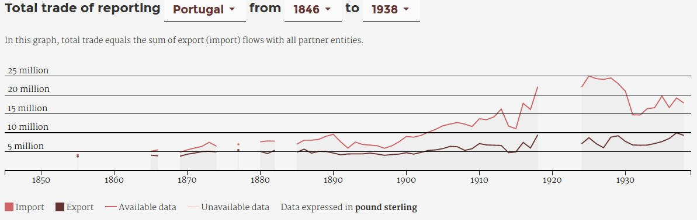
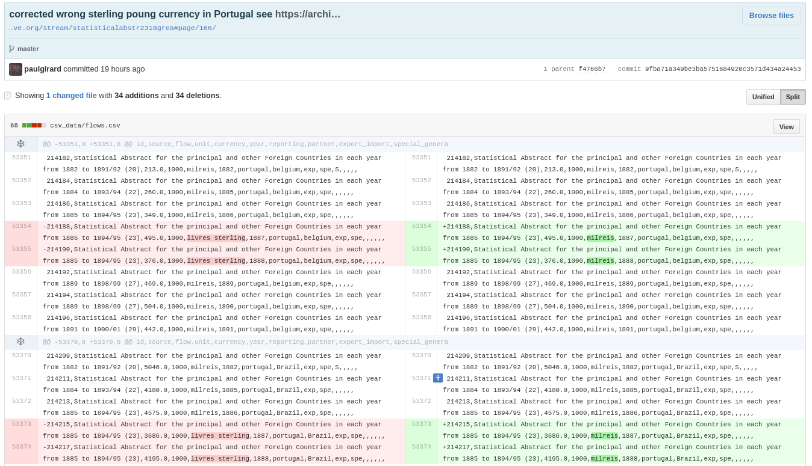

<h1 id="main">Explorer association et transformation  à travers des datascapes</em></h1>

  Paul Girard, Mathieu Jacomy & Christophe Leclercq 
  

 

 <small>Science XXL 
  Ce que l’abondance et la diversité des données font aux sciences sociales 
  Ined, Paris, les 16 et 17 mars 2017
  </small>

===

La conception de **datascape**  
est une méthode de recherche qui propose  
de créer ensemble  
**un corpus et un instrument d’exploration visuelle**  
capable de **transformer** les données  
**à la volée et de façon réversible**  
pour en vérifier l'**intégrité**  
et en tirer de **nouvelles hypothèses et interprétations**.
===

## une variété de datascapes

- [E.A.T. datascape](http://jiminy.medialab.sciences-po.fr/eat_datascape), histoire de l'art, archives, 2012
- [La fabrique de la loi](http://www.lafabriquedelaloi.fr/), sciences politiques, (open) data, 2014
- [Climate negotiations browser](http://www.climatenegotiations.org/), controverses et relations internationales, archives, 2015
- **[RICardo](http://ricardo.medialab.sciences-po.fr/), histoire de l'économie, archives, 2016**
- [TOFLIT18](https://toflit18.hypotheses.org/), histoire de l'économie, archives, prévu en 2017
- [Insurance for building trust and enabling Big Data](http://www.medialab.sciences-po.fr/projets/insurance-big-data/), sociologie, corpus web, prévu en 2017

===

<!-- .slide: data-background-image="./assets/argentine_statAbstract1870-1880.png"-->

[Statistical Abstract for the principal and other foreign countries in each year from 1871 to 1880-81](https://archive.org/stream/statisticalabstr9101unse#page/n137/mode/2up)<!-- .element: style="background-color: white;"-->

===

## RICardo ⋅ commerce bilateral

Flux de commerce entre ~~pays~~ entités  
**A <⋅⋅> B**

  

<small>(Dedinger & Girard 2017)</small>

===

<!-- .element: style="width:50%; background-color: black; margin-top: 0;"-->

===

## RICardo ⋅ commerce total

Flux de commerce entre les entités A et le monde  
**A <⋅⋅> M**

<small>(Dedinger & Girard 2017)</small>

===
## RICardo ⋅ XIXème siècle

<em>données annuelles</em>  
1787 ⋅ ⋅ ⋅ ⋅ ⋅ ⋅ ⋅ ⋅ ⋅ ⋅ ⋅ ⋅ 1938

<small>(Dedinger & Girard 2017)</small>

===
## [Le datascape RICardo](http://ricardo.medialab.sciences-po.fr) 

*Quatre vues progressives*

**Métadonnées** > **Monde** > **Pays** > **Bilatérale**

<small>(Girard & al. 2016)</small>

Note:
démo avec focus sur :
- la documentation visuelle metadata + null values
- la progressivité
- la liste des partenaires (regroupement des entités hétérogènes)

===

A chaque Datascape sa **conception spécifique**
- **modélisation** : base de données
- **forme** : sémiologie graphique
- **quantification** : algorithmes
- **exploration** : chemins interactifs

Lien outil-recherche pensé en s'inspirant des travaux de la Sociologie des Sciences et des Techniques.

<small>(Latour 1993), (Bowker 2000)</small>

===

Ateliers **interdisciplinaires** de co-conception

- Sciences Humaines et Sociales
- Ingénierie logicielle
- Sciences des données
- Design de l'information et de l'interaction

 
Traitant les enjeux  
de **contenu**, **implémentation** et de **design**  
en même temps et au même endroit.
===

Exploiter complexité et hétérogénéité des données
- **représenter** sans tromper
- multiplier **les points de vue**
- transformer, filtrer et agréger **à la demande**
- raccourcir les cycles **calcul-interprétation**
- favoriser l'**émergence de motifs** par l'exploration
- mieux lire pour **mieux comprendre**

===

L'**abondance** et la **diversité** des données demandent des équipements spécifiques.  

Construire des **corpus-instruments**, comme des interfaces d'exploration qui prennent en compte la **spécificité** des corpus et des questions de recherche.
  
Merci de votre attention.
  
[https://medialab.github.io/publications/datascape@scienceXXL](https://medialab.github.io/publications/datascape@scienceXXL)
[http://ricardo.medialab.sciences-po.fr](http://ricardo.medialab.sciences-po.fr)

===

### bibliographie

===
### à propos de RICardo

Dedinger, Béatrice, et Paul Girard. 2017. <em>« Exploring trade globalization in the long run: The RICardo project »</em>. Historical Methods: A Journal of Quantitative and Interdisciplinary History 50 (1): 30‑48. doi:10.1080/01615440.2016.1220269.
 
[http://ricardo.medialab.sciences-po.fr](http://ricardo.medialab.sciences-po.fr).

Girard, Paul, Béatrice Dedinger, Donato Ricci, Benjamin Ooghe-Tabanou, Mathieu Jacomy, Guillaume Plique, and Grégory Tible. 2016. <em>‘RICardo Project : Exploring XIX Century International Trade’. In . Kraków, Poland.</em>
 
[http://medialab.github.io/ricardo](http://medialab.github.io/ricardo).  
[http://dh2016.adho.org/abstracts/177](http://dh2016.adho.org/abstracts/177).

===

Girard, Paul, et Guillaume Plique. 2016. « Des archives du commerce à des données quantifiables, une longue chaîne de transformation des données ». présenté à ANF MATE-SHS, Collecter et produire des données pour la recherche en SHS, Fréjus, novembre 16. http://medialab.github.io/toflit18/ANFmateSHS.

Leclercq, Christophe. 2016. « Le projet E.A.T. Datascape ou ce que le design numérique peut faire à l’histoire sociale de l’art ». In à paraître. www.collecta.fr.

Leclercq, Christophe, et Paul Girard. 2013. « The Experiments in Art and Technology Datascape ». In Collections électroniques de l’INHA. Actes de Colloques et Livres En Ligne de l’Institut National D’histoire de L’art. INHA. http://inha.revues.org/4926.

Latour, Bruno, Pablo Jensen, Tommaso Venturini, Sébastian Grauwin, and Dominique Boullier. 2012. <em>‘“The Whole Is Always Smaller than Its Parts” - a Digital Test of Gabriel Tardes’ Monads’</em>. The British Journal of Sociology 63 (4): 590–615. doi:10.1111/j.1468-4446.2012.01428.x.

===

Latour, Bruno. 1993. <em>‘Le Topofil de Boa-Vista. La Référence Scientifique: Montage Photophilosophique’</em>. Raisons Pratiques 4: 187–216.

Bowker, G. C. 2000. <em>« Biodiversity Datadiversity »</em>. Social Studies of Science 30 (5): 643‑83. doi:10.1177/030631200030005001.

Tukey, John Wilder. 1977. <em>Exploratory Data Analysis</em>. Addison-Wesley Publishing Company.

Lazer, David, Alex Pentland, Lada Adamic, Sinan Aral, Albert-Laszlo Barabasi, Devon Brewer, Nicholas Christakis, et al. 2009. <em>« Social Science. Computational Social Science »</em>. Science (New York, N.Y.) 323 (5915): 721‑23. doi:10.1126/science.1167742.

Ollion, Étienne, et Julien Boelaert. 2015. <em>« Au-delà des big data »</em>. Sociologie, nᵒ N°3, vol. 6 (novembre). https://sociologie.revues.org/2613.

===
#Annexes
===
## La volumétrie de RICardo 
- 294138 flux
- 1492 RICentities
- 152 années
- 120 monnaies
- 7206 taux de change vers le £
- 73 types de sources (919 volumes)

stockées dans 9 fichiers csv versionnés dans git

===

<!-- .slide: data-transition="none"-->

## Visualisation de données

  

⬆ oups !  <!-- .element: class="fragment" data-fragment-index="1" style="margin-left:400px"-->  

===
<!-- .slide: data-transition="none"-->
## Vérifier et corriger les données

  
  
\- corrigé -
===
<!-- .element: style="margin:0;padding:0"-->

===
<!-- .slide: data-background-image="./assets/internetarchive_statisticalabstract.png"-->
<a href="https://archive.org/stream/statisticalabstr2318grea#page/166/mode/2up" target="_blank" style="background:black; padding:20px">Statistical abstract, P. 166 @ Internet Archive</a>

===
### La chaîne de transformations
volumes d'archive > images > excel > git(csv) > base de données > visualisation de données **> csv**<!-- .element: class="fragment" data-fragment-index="1"-->

