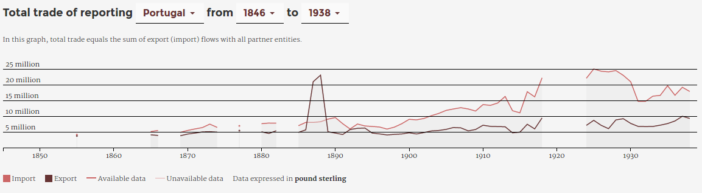

<h1 id="main">Explorer association et transformation  à travers des datascapes</em></h1>

  Paul Girard, Mathieu Jacomy & Christophe Leclercq 
  

 

 <small>Science XXL 
  Ce que l’abondance et la diversité des données font aux sciences sociales 
  Ined, Paris, les 16 et 17 mars 2017
  </small>

===

La conception de **datascape** est une méthode de recherche qui propose de  
créer **ensemble un corpus et un instrument d’exploration visuelle**  
capable de **transformer à la volée et de façon réversible** les données  
pour en vérifier l'**intégrité** et en tirer de **nouvelles hypothèses et interprétations**.
===

## une variété de tentatives
<small>

- [E.A.T. datascape](http://jiminy.medialab.sciences-po.fr/eat_datascape), histoire de l'art, archives, 2012
- [La fabrique de la loi](http://www.lafabriquedelaloi.fr/), sciences politiques, (open) data, 2014
- [Climate negotiations browser](http://www.climatenegotiations.org/), Science and Technology Studies, archives, 2015
- **[RICardo](http://ricardo.medialab.sciences-po.fr/), histoire de l'économie, archives, 2016**
- [TOFLIT18](https://toflit18.hypotheses.org/), histoire de l'économie, archives, prévu en 2017
- [Insurance for building trust and enabling Big Data](http://www.medialab.sciences-po.fr/projets/insurance-big-data/), sociologie, corpus web, prévu en 2017

</small>

===

<!-- .slide: data-background-image="./assets/argentine_statAbstract1870-1880.png"-->

[Statistical Abstract for the principal and other foreign countries in each year from 1871 to 1880-81](https://archive.org/stream/statisticalabstr9101unse#page/n137/mode/2up)<!-- .element: style="background-color: white;"-->

===

## RICardo ⋅ commerce bilateral

Flux de commerce entre ~~pays~~ entités  
**A <⋅⋅> B**

===

<!-- .element: style="width:50%; background-color: black; margin-top: 0;"-->

===

## RICardo ⋅ commerce total

Flux de commerce entre les entités A et le monde  
**A <⋅⋅> M**

===
## RICardo ⋅ XIXème siècle

<em>données annuelles</em>  
1787 ⋅ ⋅ ⋅ ⋅ ⋅ ⋅ ⋅ ⋅ ⋅ ⋅ ⋅ ⋅ 1938

===
## Le datascape RICardo 

*Quatre vues progressives*

**Métadonnées** > **Monde** > **Pays** > **Bilatérale**

démo avec focus sur :
- la documentation visuelle metadata + null values
- la progressivité
- la liste des partenaires (regroupement des entités hétérogènes)
===

## Le datascape RICardo 
- 294138 flux
- 1492 RICentities
- 152 années
- 120 monnaies
- 7206 taux de change vers le £
- 73 types de sources (919 volumes)

stockées dans 9 fichiers csv versionnés dans git

===

<!-- .slide: data-transition="none"-->

## Visualisation de données

  

⬆ oups !  <!-- .element: class="fragment" data-fragment-index="1" style="margin-left:400px"-->  

===
<!-- .slide: data-transition="none"-->
## Vérifier et corriger les données

  
  
\- corrigé -
===

===
<!-- .slide: data-background-image="./assets/internetarchive_statisticalabstract.png"-->
<a href="https://archive.org/stream/statisticalabstr2318grea#page/166/mode/2up" target="_blank" style="background:black; padding:20px">Statistical abstract, P. 166 @ Internet Archive</a>

===
### La chaîne de transformations
volumes d'archive > images > excel > git(csv) > base de données > visualisation de données **> csv**<!-- .element: class="fragment" data-fragment-index="1"-->
===
Enjeux
- ~~masse~~ complexité et hétérogénéité des données
- hybrider les approches qualitative et quantitative
- révéler les chaînes de transformation des données
- favoriser l'émergence de motif par l'exploration
- interdisciplinarité : SHS, ingénierie et design 
- adoption : co-conception

===

A chaque Datascape sa conception spécifique
- modèles de données : base de données
- forme des données : sémiologie graphique
- quantification des données : algorithmes
- chemins interactifs : exploration interactive

Choix guidés par les travaux en :
- Sociologie des Sciences et des Techniques
- Design de l'information et de l'interaction
- Sciences des données

===

### Atelier de conception interdisciplinaire

Ateliers appelés *«data sprints»* mêlant :

- Sciences Humaines et Sociales
- Ingénierie logicielle
- Sciences des données
- Design de l'information et de l'interaction

Traitant les enjeux de **contenu**, **implémentation** et de **design**  
en même temps et au même endroit.
===
## Science ouverte

- télécharger les données des visualizations en csv
- corpus de données seront ouverts en 2017  
CC BY-SA
- RICardo : [http://ricardo.medialab.sciences-po.fr](http://ricardo.medialab.sciences-po.fr)
- sources RICardo : [github.com/medialab/ricardo](https://github.com/medialab/ricardo)
- cette présentation: [http://medialab.github.io/toflit18/ANFmateSHS](https://medialab.github.io/publications/datascape@scienceXXL)    

===

## Bibliographie & Liens (1/2)

Dedinger, Béatrice, and Paul Girard. 2016. <em>‘Exploring Trade Globalization in the Long Run : The RICardo Project’</em>. Historical Methods.
 
[http://ricardo.medialab.sciences-po.fr](http://ricardo.medialab.sciences-po.fr).

Girard, Paul, Béatrice Dedinger, Donato Ricci, Benjamin Ooghe-Tabanou, Mathieu Jacomy, Guillaume Plique, and Grégory Tible. 2016. <em>‘RICardo Project : Exploring XIX Century International Trade’. In . Kraków, Poland.</em>
 
[http://ricardo.medialab.sciences-po.fr/Girardetal_RICardo_dh2016_en.pdf](http://ricardo.medialab.sciences-po.fr/Girardetal_RICardo_dh2016_en.pdf).

===

## Bibliographie & Liens (2/2)

Latour, Bruno. 1993. <em>‘Le Topofil de Boa-Vista. La Référence Scientifique: Montage Photophilosophique’</em>. Raisons Pratiques 4: 187–216.

Latour, Bruno, Pablo Jensen, Tommaso Venturini, Sébastian Grauwin, and Dominique Boullier. 2012. <em>‘“The Whole Is Always Smaller than Its Parts” - a Digital Test of Gabriel Tardes’ Monads’</em>. The British Journal of Sociology 63 (4): 590–615. doi:10.1111/j.1468-4446.2012.01428.x.

Tukey, John Wilder. 1977. <em>Exploratory Data Analysis</em>. Addison-Wesley Publishing Company.

