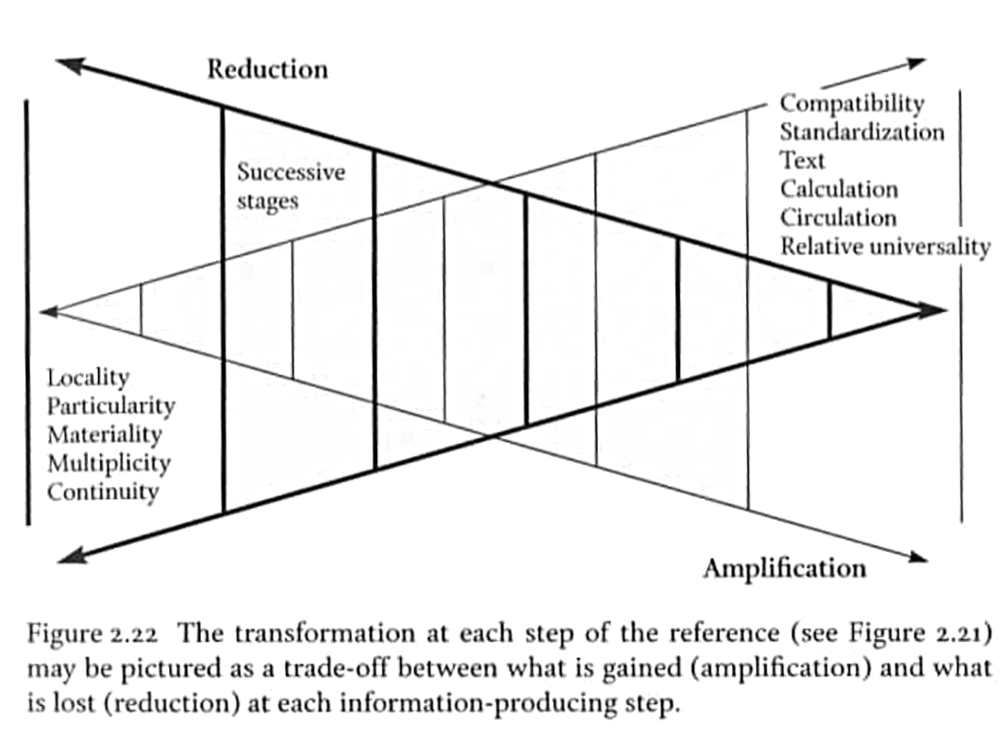
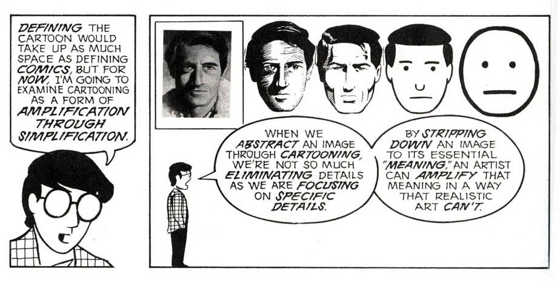

<h1 id="main">Studying and exploring digital traces through datascapes <em>the interdisciplinary experience at Science Po médialab</em></h1>

  [Paul Girard](http://www.medialab.sciences-po.fr/people/paul-girard/) [@paulanomalie](https://twitter.com/paulanomalie) 
  

 <small>
[Datavisualisation in Sociology and Social Sciences](http://www.sociologie.be/datavisualisatie/) 
Brussels, Tuesday, December 12th 2017 
organised by VVS and [NSV](http://www.nsv-sociologie.nl/) with support from the [ISA](http://www.isa-sociology.org/en/)
  </small>

===
Enrico Bertini wrote in  
[From Data Visualization to Interactive Data Analysis](https://medium.com/@FILWD/from-data-visualization-to-interactive-data-analysis-e24ae3751bf3)  
*« **Visualization** projects with high visibility focus on two main purposes: **inspiration** and **explanation**. Visualization can however be used (and is actually used) to increase understanding of complex problems through **data analysis**. These project are less visible but by no means less important. »*  

===

## Exploratory Data Analysis

> « The greatest value of a picture is when it
forces us to notice what we never expected to
see. »  
John W. Tukey
  
<small>**Tukey, J. W.** (1977). *Exploratory Data Analysis*. Addison-Wesley Publishing Company.</small>

===

Designing **datascapes**  
is a research method  
which consists in designing **simultaneously**  
a **dataset**  
and an **exploratory data analysis** instrument.
It combines **interactive** tools to  
**visualise**, **aggregate** and **filter** data **dynamically**   
fostering **data integrity** checks  
and emergence of **new hypotheses and interpretations**

===

## our datascapes

- **[E.A.T. datascape](http://jiminy.medialab.sciences-po.fr/eat_datascape), art history, from archives, 2012**
- [La fabrique de la loi](http://www.lafabriquedelaloi.fr/), political sciences, from *almost* open data, 2014
- [Climate negotiations browser](http://www.climatenegotiations.org/), controversies and international relationships, from archives, 2015
- **[RICardo](http://ricardo.medialab.sciences-po.fr/), economic history, from 18th century archives, 2016**
- [TOFLIT18](https://toflit18.hypotheses.org/), economic history, from 17th century archives, early 2018... hopefully
- [Insurance for building trust and enabling Big Data](http://www.medialab.sciences-po.fr/projets/insurance-big-data/), sociology, from a web corpus, 2017
===

<!-- .slide: data-background-image="./assets/EAT_Oracle.png"-->

[&nbsp;Experiment in Art and Technology Datascape&nbsp;](http://jiminy.medialab.sciences-po.fr/eat_datascape)<!-- .element: style="background-color: #DDDDDD;"-->
===

<!-- .slide: data-background-image="./assets/RICardo_World.png"-->

[ RICardo Trade between Nations from c. 1800 to 1938](http://jiminy.medialab.sciences-po.fr/eat_datascape)<!-- .element: style="background-color: #DDDDDD;"-->
===

# why ?

===
### whole smaller than its parts?
> "Our approach suggests a **way of navigating** through these datascapes with a **monadological** point of view, which can capture the **richness of associations** while remaining faithful to the **complexity of agents**."
(Latour et al. 2012)

===

### ex-ante vs ex-post structure

> "**When we navigate on a screen**, zooming in and out,
changing the projection rules, aggregating and disaggregating according to different variables, what stands out is **what remains constant through the shifting of viewpoints** (Gibson 1986). This is our ‘whole’ [...] much smaller than the sum of its parts"  
(Latour et al. 2012)
===
###Chain of references

<!-- .element: style="width:80%;margin:0; padding-left:10%"--> 
(Latour 1993)

===
###Chain of symbolisms
<!-- .element: style="margin:0"--> 

(McCloud 1993)

===
# How to ?
===
At each Datascape, a **specific design**
- **data model** : databases
- **forms** : graphic semiology
- **quantification** : algorithms
- **exploration** : interactive paths

Research instruments designed with the work of Science and Technology Studies in mind.

<small>(Latour 1993), (Bowker 2000)</small>

===

Data Sprints:  
**interdisciplinary** design workshops

- Social Sciences and/or Humanities
- Information Technology ingeniery
- Data Science
- Information and Interactive Design

 
Adressing **content**, **implementation** and **design** issues  
at the same place et at the same time.
===

Leverage data complexity and heterogeneity
- **to visualize** without misleadings
- to shift **viewpoints**
- to filter and aggregate **on demand**
- to shorten **computation-interpretation** cycles
  
A better **data reading experience** to foster **patterns emergence** through exploration.

===

# Limits

===
## Research instruments 
## ≠
## Publications

===
## Such an investment!? 
## Just to raise questions?
===
## Data reading-writing cycles
We need better data curation tools  
Embed in exploration interfaces  
Now !
===
## Better UX for custom aggregations
===

## Datascape?
## Just an other buzzword

===

## Data deluge ?

Let's build **dataset-instruments**, as exploration interfaces to support specific data-research questions.
  
*thank you for your attention*.

Paul Girard  
@paulanomalie  
  
[https://medialab.github.io/publications/datascape@sociologie.be](https://medialab.github.io/publications/datascape@sociologie.be)
[http://medialab.sciences-po.fr](http://medialab.sciences-po.fr)

===

### bibliographie

===
### à propos de RICardo

Dedinger, Béatrice, et Paul Girard. 2017. <em>« Exploring trade globalization in the long run: The RICardo project »</em>. Historical Methods: A Journal of Quantitative and Interdisciplinary History 50 (1): 30‑48. doi:10.1080/01615440.2016.1220269.
 
[http://ricardo.medialab.sciences-po.fr](http://ricardo.medialab.sciences-po.fr).

Girard, Paul, Béatrice Dedinger, Donato Ricci, Benjamin Ooghe-Tabanou, Mathieu Jacomy, Guillaume Plique, and Grégory Tible. 2016. <em>‘RICardo Project : Exploring XIX Century International Trade’. In . Kraków, Poland.</em>
 
[http://medialab.github.io/ricardo](http://medialab.github.io/ricardo).  
[http://dh2016.adho.org/abstracts/177](http://dh2016.adho.org/abstracts/177).

===

Girard, Paul, et Guillaume Plique. 2016. « Des archives du commerce à des données quantifiables, une longue chaîne de transformation des données ». présenté à ANF MATE-SHS, Collecter et produire des données pour la recherche en SHS, Fréjus, novembre 16. http://medialab.github.io/toflit18/ANFmateSHS.

Leclercq, Christophe. 2016. « Le projet E.A.T. Datascape ou ce que le design numérique peut faire à l’histoire sociale de l’art ». In à paraître. www.collecta.fr.

Leclercq, Christophe, et Paul Girard. 2013. « The Experiments in Art and Technology Datascape ». In Collections électroniques de l’INHA. Actes de Colloques et Livres En Ligne de l’Institut National D’histoire de L’art. INHA. http://inha.revues.org/4926.

Latour, Bruno, Pablo Jensen, Tommaso Venturini, Sébastian Grauwin, and Dominique Boullier. 2012. <em>‘“The Whole Is Always Smaller than Its Parts” - a Digital Test of Gabriel Tardes’ Monads’</em>. The British Journal of Sociology 63 (4): 590–615. doi:10.1111/j.1468-4446.2012.01428.x.

===

Latour, Bruno. 1993. <em>‘Le Topofil de Boa-Vista. La Référence Scientifique: Montage Photophilosophique’</em>. Raisons Pratiques 4: 187–216.

Bowker, G. C. 2000. <em>« Biodiversity Datadiversity »</em>. Social Studies of Science 30 (5): 643‑83. doi:10.1177/030631200030005001.

Tukey, John Wilder. 1977. <em>Exploratory Data Analysis</em>. Addison-Wesley Publishing Company.

Lazer, David, Alex Pentland, Lada Adamic, Sinan Aral, Albert-Laszlo Barabasi, Devon Brewer, Nicholas Christakis, et al. 2009. <em>« Social Science. Computational Social Science »</em>. Science (New York, N.Y.) 323 (5915): 721‑23. doi:10.1126/science.1167742.

Ollion, Étienne, et Julien Boelaert. 2015. <em>« Au-delà des big data »</em>. Sociologie, nᵒ N°3, vol. 6 (novembre). https://sociologie.revues.org/2613.

===
#Annexes
===
## La volumétrie de RICardo 
- 294138 flux
- 1492 RICentities
- 152 années
- 120 monnaies
- 7206 taux de change vers le £
- 73 types de sources (919 volumes)

stockées dans 9 fichiers csv versionnés dans git

===

<!-- .slide: data-transition="none"-->

## Visualisation de données

  

⬆ oups !  <!-- .element: class="fragment" data-fragment-index="1" style="margin-left:400px"-->  

===
<!-- .slide: data-transition="none"-->
## Vérifier et corriger les données

  
  
\- corrigé -
===
<!-- .element: style="margin:0;padding:0"-->

===
<!-- .slide: data-background-image="./assets/internetarchive_statisticalabstract.png"-->
<a href="https://archive.org/stream/statisticalabstr2318grea#page/166/mode/2up" target="_blank" style="background:black; padding:20px">Statistical abstract, P. 166 @ Internet Archive</a>

===
### La chaîne de transformations
volumes d'archive > images > excel > git(csv) > base de données > visualisation de données **> csv**<!-- .element: class="fragment" data-fragment-index="1"-->

