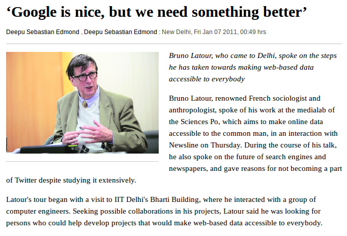
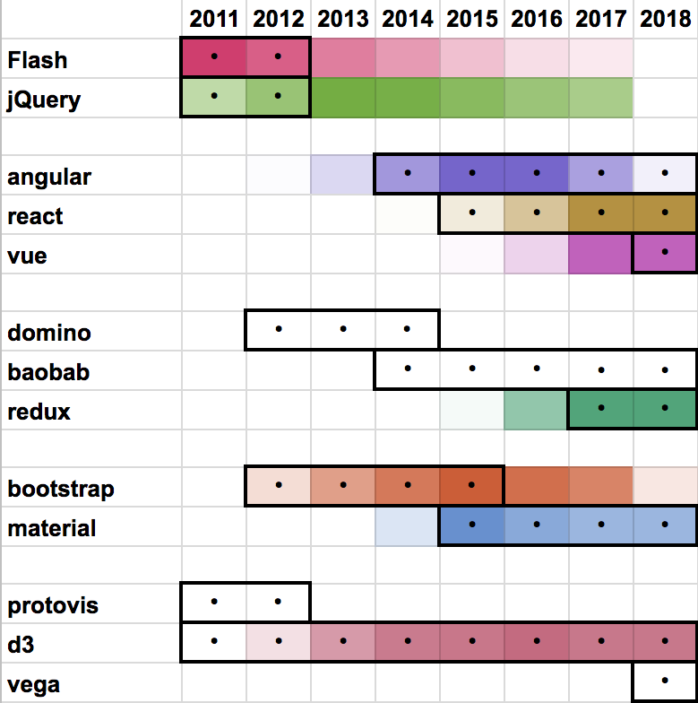
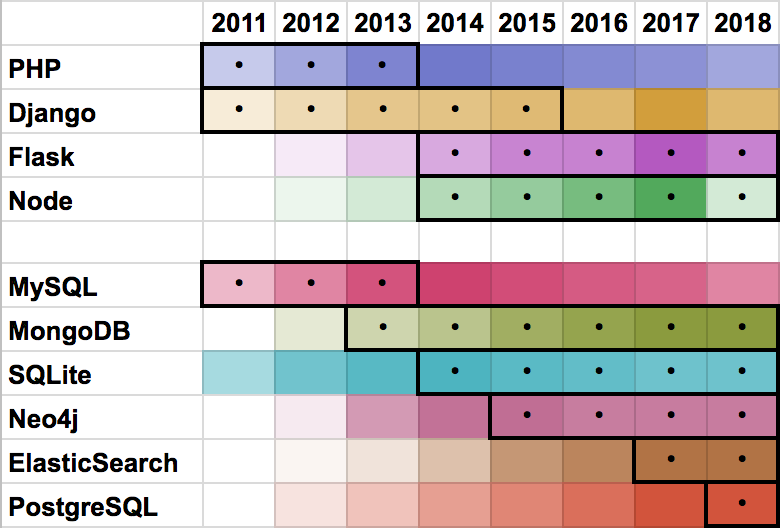

# Le JavaScript comme outil de recherche en SHS

[@paulanomalie](https://twitter.com/paulanomalie) et [@yomguithereal](https://twitter.com/yomguithereal) du [@medialab_scpo](https://twitter.com/medialab_scpo)
  

[@nantesjs](https://twitter.com/nantesjs) le 17/04/2018
  
[<!-- .element: style="width: 150px;"-->](nantesjs.org)[<!-- .element: style="height: 150px;float:right;"-->](http://medialab.sciencespo.fr)

---

## Sciences Humaines et Sociales

- **Questions** : qu'est ce qui fait société ?...
- **Terrains** : population, documents, archives...
- **Méthodes** : entretiens, sondage, observations, analyse de données...

---

## 2009
Création du **[médialab](http://medialab.sciencespo.fr)** par Bruno Latour

Sociologie et instruments numériques de recherche

---

## 2011

[Bruno Latour, Janvier 2011, Indian Express](http://archive.indianexpress.com/news/-google-is-nice-but-we-need-something-better-/734368/)

---

## Un labo de SHS qui utilise le web?

1. **Connaître le web** pour pouvoir l'analyser
2. **Produire des logiciels** pour des chercheurs
3. **Utiliser le web** pour créer/diffuser des outils

=> maîtriser les technologies du web<!-- .element: class="fragment" -->

Note: loop.

---

## Exemples

---

<h2>
  I. Récupérer et structurer  des données de pages web
</h2>

---

## Question
Politique de **santé publique** : naissances par **césarienne**

## Méthode
Qu'en disent les gens sur des forums comme **aufeminin.com** ou **doctissimo** ?

---

## Le scraping

* **Structurer** des données à partir du WWW
* Rétro-ingénierie du **templating DOM**
* **Embûches** dans le web moderne: dynamisme, authentification etc.

---

## artoo.js

* **Plutôt que d'émuler** les technos web, **parasitons** les technos web
* **Bookmarklet** injectant des helpers de scraping dans les pages web
* Création de bookmarklets **sur-mesure** pour les chercheurs
* Le **navigateur web** comme plateforme de scraping

*powered by :*  
**depuis 2014** - JQuery

Note: les gens utilisent leur propre navigateur avec leurs données de navigation perso. côté légal, pas de transmission de données

---
<!-- .slide: data-background-image="./img/artoo.png"-->

[https://medialab.github.io/artoo/](https://medialab.github.io/artoo/)
<!-- .element: style="margin-top:60%; text-align:center;background:#000;padding:10px;" -->

---

<h2>
  II. Collectionner et analyser  des pages web
</h2>

---
## Question
Comment s'organisent les **communautés** de développeurs JS ?
## Méthode
Trouver des **sites web** de développeurs JS et les analyser

---

## Le crawling

1. Récupérer des pages web et **extraire leurs liens**
2. Demander au chercheur: **quels liens suivre ?**
3. **GoTo 1**
4. **Analyser le réseau** produit (ou le texte des documents)

---

## Hyphe

* Un moteur de **crawl**
* Un **index** des données
* Une **interface** simple pour les contrôler
* Une **visualisation de réseaux** dans un navigateur
* Un **navigateur web** sur-mesure

*powered by :*  
**2013 v0.1** - bootstrap, [domino.js](https://github.com/jacomyal/domino.js), [sigma.js](http://sigmajs.org/), python twisted + scrapy, Mongo, Java Lucene  
**2014 v0.2** - *~~bootstrap, domino.js~~* material, angular  
**2015 v1** - *~~Java Lucene~~* [hyphe-traph](https://github.com/medialab/hyphe-traph)\*, [graphology](https://graphology.github.io/)

\**custom index en python après avoir testé neo4j*

---

<!-- .slide: data-background-image="./img/hyphe_echojs.png"-->

[http://hyphe.medialab.sciences-po.fr/demo](http://hyphe.medialab.sciences-po.fr/demo)
<!-- .element: style="margin-top:60%; text-align:center;background:#000;padding:10px;" -->

---

<h2>
  III. Analyser des données complexes  par l'exploration
</h2>

---
## Question
Comment a évolué le **commerce de la France au XVIIIème siècle** ?

Quelle spécialisation **régionale** ?  **Par marchandise** ?

## Méthode
- Des chercheurs assemblent des **données d'archive** du XVIIIe siècle
- Comment traiter et faire sens de cette masse de **données complexes**?

---

## L'analyse exploratoire de données

* **Numériser** des données
* **Structurer** des données
* **Nettoyer** des données
* **Versionner** des données
* **Agréger et visualiser** des données **dynamiquement**

---

## Le datascape TOFLIT18

* Une **base** de données
* Un **backend** traitant les requêtes
* Un **client riche** capable de produire des **dataviz sur mesure**
* Une **UX** proposant des parcours d'exploration

*powered by :*  
**depuis 2016** - react, [baobab](https://github.com/Yomguithereal/baobab), [sigma.js](http://sigmajs.org/), [talisman](http://yomguithereal.github.io/talisman/), node.js, neo4j

---

<!-- .slide: data-background-image="./img/datascapes/toflit18.png"-->

[http://toflit18.medialab.sciences-po.fr](http://toflit18.medialab.sciences-po.fr)
<!-- .element: style="margin-top:60%; text-align:center;background:#000;padding:10px;" -->

---

<h2>
  IV. Réaliser une enquête  philosophique collaborative
</h2>

---

## Question
Une **anthropologie** des modernes ?
## Méthode
* Produire un **rapport d'enquête**
* Convier d'autres chercheurs à **contribuer** à l'enquête

---

## Une enquête collective

1. Publier un rapport d'enquête dans **un livre**
2. Publier la **documentation hypertexte** en ligne
3. Ajouter un système de **collaboration/modération**
4. Organiser des **ateliers avec les co-enquêteurs**

---

## An Inquiry Into Modes of Existence

* **Structurer** les contenus d'un **livre** et ses **annotations**
* Structurer **glossaire** et **documentation**
* Stocker dans une **base de données**
* Servir par une **API**
* Un **client riche** permettant de : 
    - lire le livre, proposer les annotations
    - lire le glossaire, proposer les passages citant
    - lire la documentation, proposer les passages citant
    - créer des annotations
    - proposer des contributions

**2012 v0** - maze + PHP Yii + MYSQL   
**2013 v1** - *~~maze~~* [domino.js](https://github.com/jacomyal/domino.js)  
**2015 v2** - *~~PHP Yii + MYSQL~~* [talisman](http://yomguithereal.github.io/talisman/), [decypher](https://github.com/Yomguithereal/decypher), node.js, neo4j

---
<a href='http://modesofexistence.org' target='_blank'>
<!-- .element: style="padding:0;margin:0;"-->
</a>

---

# Résumons

---

<!-- .element: style="padding:0;margin:0;width:70%;"-->

---

<!-- .element: style="padding:0;margin:0;width:70%;"-->

---

## Enjeux JavaScript

- **Dualité client - serveur** : code universel grâce à node.js
- **Hautes ambitions en UX/UI** : R&D et adoption d'application frameworks
- **Algorithmie et scalabilité**: besoin d'éxécuter efficacement nos calculs
- **Science des données  en JS** : [graphology]([graphology](https://graphology.github.io/), [talisman](http://yomguithereal.github.io/talisman/), [mnemonist](https://yomguithereal.github.io/mnemonist/), [decypher](https://github.com/Yomguithereal/decypher)

---

## Evolution permanente

- Réflexivité : R&D piloté par les problèmes rencontrés
- Open Source : consomacteur

---

## ~~Stratégies~~
   
* Hype-driven development <!-- .element: class="fragment" -->
* R&D-driven development <!-- .element: class="fragment" -->
* Personal-driven development <!-- .element: class="fragment" -->

---

Merci

[http://github.com/medialab](http://github.com/medialab)  
[http://github.com/yomguithereal](http://github.com/yomguithereal)
