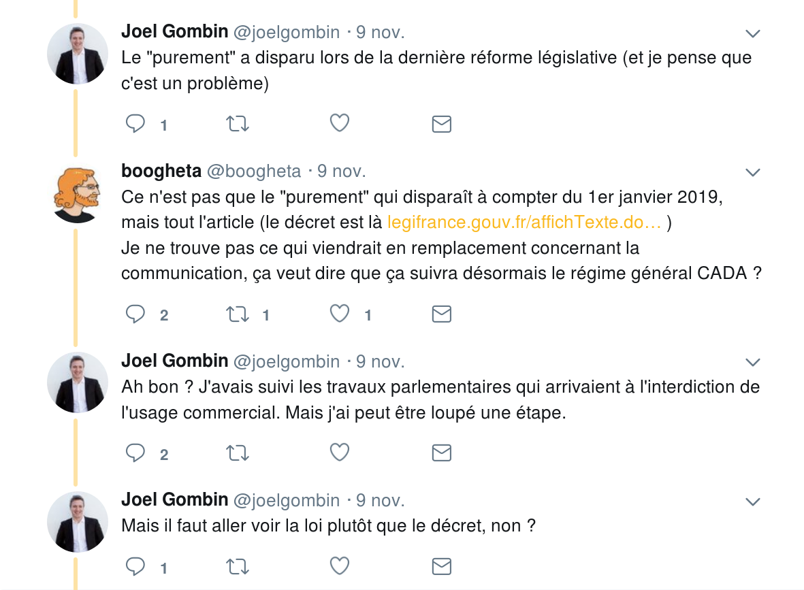
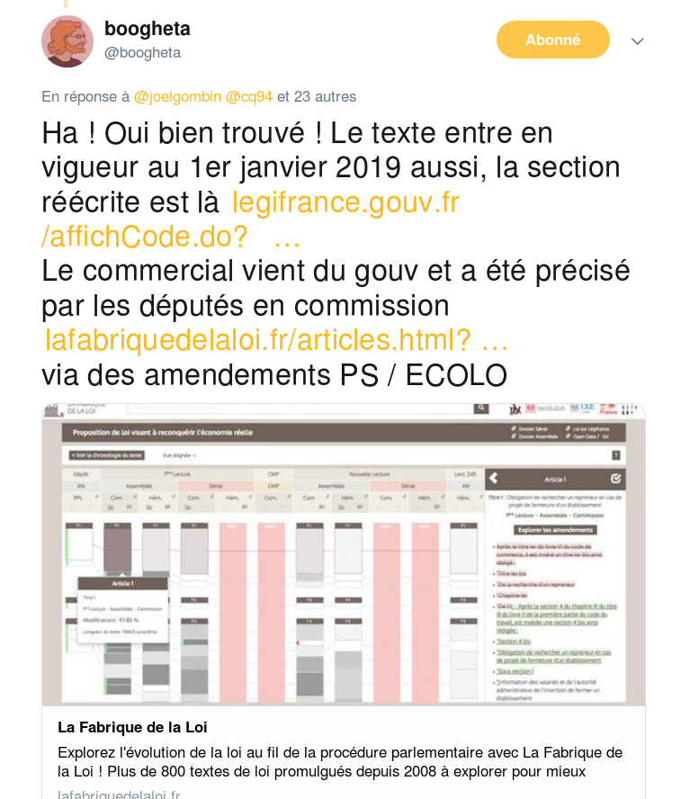
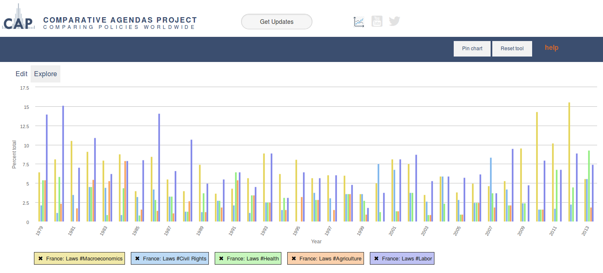
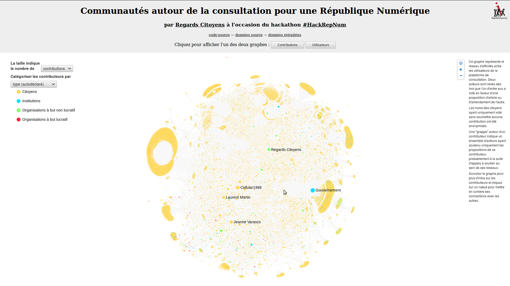
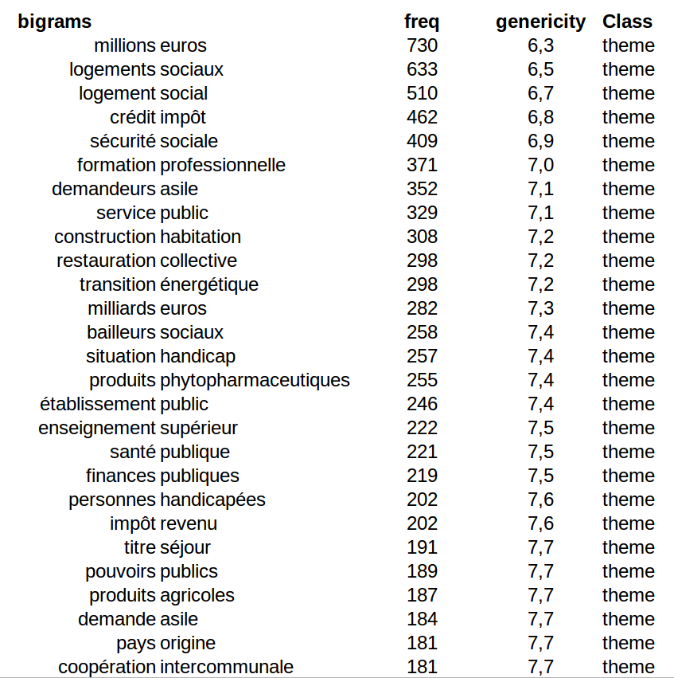

<h2>
The Law Factory project
</h2>

séminaire mutations numériques - 16/11/2018
  
 

Paul Girard°,
Benjamin Ooghe-Tabanou°, Olivier Rozenberg*, Damien Marié°, [Regards citoyens](https://www.regardscitoyens.org) 

<small>°Sciences Po médialab - *Science Po CEE 
With the support of Sciences Po LIEPP</small>

---

## 1. To reveal the law writing process

[The law factory project](https://www.lafabriquedelaloi.fr) :
- collaboration [Regards Citoyens](https://www.regardscitoyens.org) - Sciences Po
- to explore the parliament activity
- to trace the law creation process
- to explore the process complexity and diversity
 
---

<section data-background='./img/LFDLL_lois.png'></section>

---

<section data-background='./img/LFDLL_procédure.png'></section>

---

<section data-background='./img/LFDLL_amendements.png'></section>
---

<section data-background='./img/LFDLL_débats_1.png'></section>
---

<section data-background='./img/LFDLL_debats_2.png'></section>
---
## French parliament digital ethnography

Both a corpus and an exploration instrument  
Systematic traces of parliament activity  
Qualitative exploration of the complexity  
Backing up quantitative analysis  

Thanks to LIEPP :
- 97% of laws from 2008
- live monitoring

---
## 2. Echoes between parliament activities and other social spaces ? 

- french digital media spaces
- citizens through social media
- citizens through participatory platforms
- lobbyists

---

### To **map actors and expressions** surrounding parliament activities
---

---

---
### To study the **agenda effects** between parliament and media

---
### To learn about **participatory platforms** effects on parliament activity

---
### To develop **socio-semantic analysis** methods

---
### To measure alignement/fragmentation of the **political parliament space**
<iframe src="https://player.vimeo.com/video/300314002" width="640" height="400" frameborder="0" webkitallowfullscreen mozallowfullscreen allowfullscreen></iframe>

<a href="https://vimeo.com/300314002">Cosignature: Alignement &amp; Fragmentation</a>

---
<iframe src="https://player.vimeo.com/video/300311817" width="640" height="323" frameborder="0" webkitallowfullscreen mozallowfullscreen allowfullscreen></iframe>

<a href="https://vimeo.com/300311817">Du rififi &agrave; l&#039;Assembl&eacute;e</a>

---

### parliament analysis
### + media studies
### + civic tech
### + computational social sciences

---
Merci

[http://medialab.sciences-po.fr](http://medialab.sciences-po.fr)  
[http://medialab.github.io/publications/lawfactory20181116](http://medialab.github.io/publications/lawfactory20181116)

